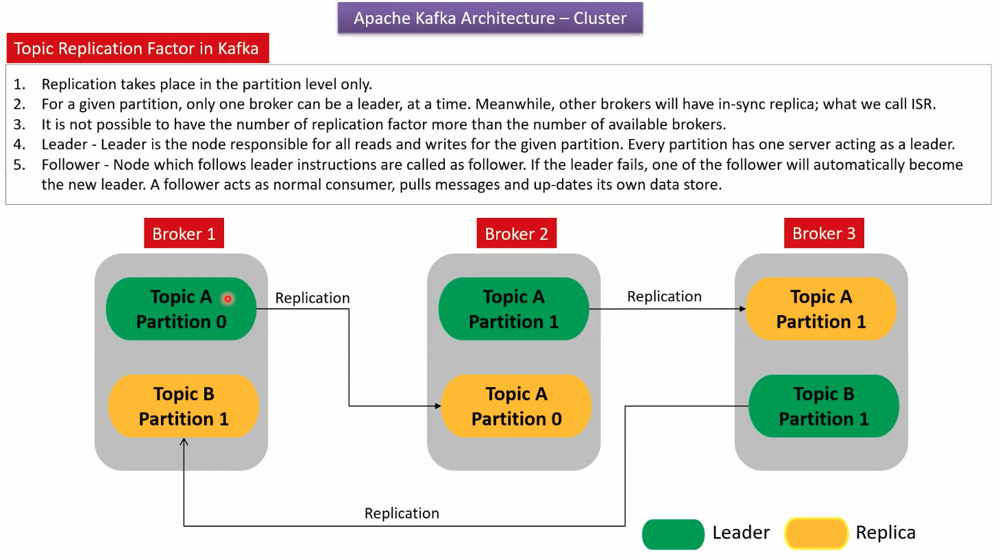

whew
# Kafka Partition Concept
```sh
 docker-compose up -d

 # create the topic (if it doesn't exist) >> auto.create.topics.enable = true ไม่ต้องทำ
docker exec -it <kafka_container_id> kafka-topics.sh --create --bootstrap-server localhost:9092 --replication-factor 1 --partitions 4 --topic my-partitioned-topic

node ./core-concept/partition/consumer.js
node ./core-concept/partition/producer.js
 ```

### Concept of Partition
  - ใน 1 broker มีได้หลาย partition แล้วแต่เราจะ config ควรใช้เท่าที่จำเป็น เพราะบางทีอาจจะเปลือง resource โดยไม่จำเป็น โดยหลักการคือ producer สามารถเลือกได้ว่า record นี้จะส่งไปที่ partition ไหน แล้ว consumer ก็สามารถเลือกได้ เช่นเดียวกันว่าจะไปดึงจาก parttion ไหน
  - ใน partition เดียวกัน ข้อมูลจะ sort แบบ first in frist out
  - แต่จะไม่เรียงว่าทำ partition ไหนก่อน แล้วแต่ระบบจัดการ

### Real-world example use case for specific partition producer and consumer:
A common use case for producing and consuming from specific partitions is when you have a requirement to maintain the order of related messages. For example, consider an e-commerce application where you want to process user orders in the order they were placed. You could use the user ID as a key to consistently hash orders to the same partition. This ensures that all orders for a given user are processed in sequence, maintaining the order of events for that user.

Producer: When creating orders, the producer uses the user ID as the key to ensure that all orders for a given user are sent to the same partition.
Consumer: The consumer processes messages from specific partitions, ensuring that it processes all orders for a given user in sequence. This might involve setting up different consumer instances or groups to handle different partitions, depending on the application's scaling and processing requirements.
This approach is useful in scenarios where the order of events is critical, such as financial transactions, order processing, or any system where the sequence of events for a particular entity (e.g., user, account) needs to be maintained.

# Kafka Replication Understanding
 - Link: https://www.youtube.com/watch?v=cAvWjlSGlEU

### Concept of Kafka Replication
 - ทุก broker จะ managed by Zookeeper ซึ่งมันคือ orchestrator
 - concept ก็คือ ทุกๆ Broker มี Partition 0, 1, 2, .. ถ้าเราทำ replication (horizontal scale) จะมีการทำ replication ไว้ที่ broker อื่นๆ
 - ซึ่ง mesage จะวิ่งไปหา partition ของ lead broker ก่อน (ถ้าไม่ down) ถ้า down ก็จะวิ่งไปหา replication broker


### Example
1.comment kafka service and uncomment kafka1, kafka2 in docker-compose.yaml

2.start dockeer
```sh
docker-compose up -d
 ```
3.now you got kafka replication

# Kafka Group Topic Example
Kafka uses consumer groups to allow a pool of processes to divide the work of consuming and processing records. These groups provide scalability and fault tolerance for Kafka consumers.

## Kafka Consumer Group Example

### Setup
Start Kafka and Zookeeper using Docker Compose:
```sh
# Start Kafka and Zookeeper
docker-compose up -d
docker exec -it <kafka_container_id> kafka-topics.sh --alter --bootstrap-server localhost:9092 --topic commission --partitions 2
docker exec -it <kafka_container_id> kafka-topics.sh --alter --bootstrap-server localhost:9092 --topic payment --partitions 2

node ./kafka-group/commissionConsumer.js 1
node ./kafka-group/commissionConsumer.js 2
node ./kafka-group/paymentConsumer.js 1
node ./kafka-group/paymentConsumer.js 2
node producer.js
```

### Observing the Output
Each consumer will print the messages it receives. You should see the payment messages being consumed by the payment-group consumers and the commission messages being consumed by the commission-group consumers.